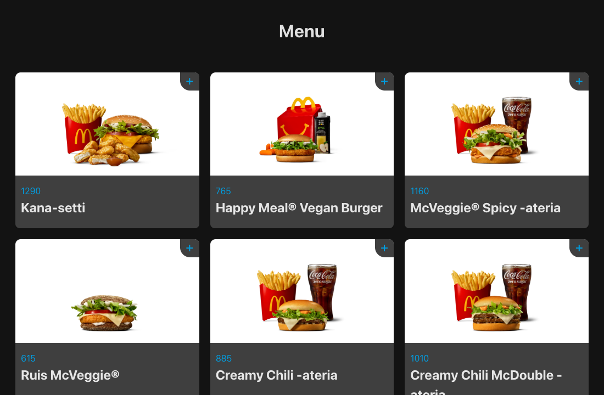

# Wolt Menu

A React app that loads a real restaurant menu from the public Wolt consumer API and shows each dish as a card with its image, name and price.



## How it works

- [`src/components/Wolt.jsx`](src/components/Wolt.jsx) fetches the menu with Axios when the page loads.
- The browser cannot call the Wolt API directly (CORS), so the Vite dev server forwards `/api` requests to `consumer-api.wolt.com` (see [`vite.config.js`](vite.config.js)).

## Built with

- React (`useState`, `useEffect`)
- Axios
- Vite dev-server proxy

## Run locally

```bash
npm install
npm run dev
```
